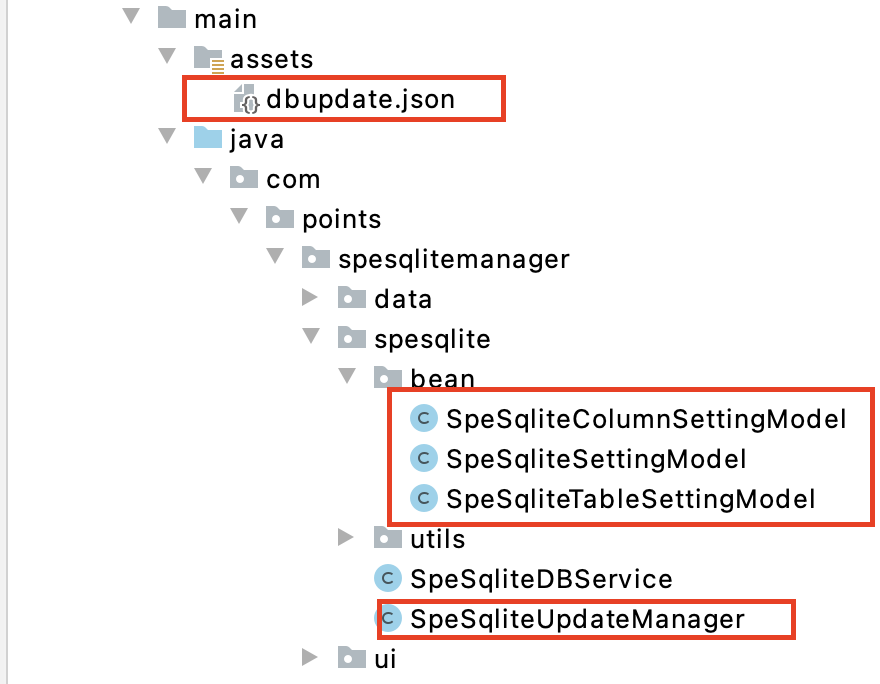

<!--
 * @Author: user.email
 * @Date: 2023-02-14 22:20:49
 * @LastEditors: user.email
 * @LastEditTime: 2023-02-17 09:17:45
 * @FilePath: /undefined/Users/Points/Documents/gitee-git/SpeSqliteManager4Android/README.md
 * @Description: 
 * 
 * Copyright (c) 2023 by ${git_email}, All Rights Reserved. 
-->
# SpeSqliteManager4Android

#### 介绍
一个轻量级无侵入式管理android数据库自动升级的管理类(支持SQLiteOpenHelper、room)

#### 实际导入代码


#### 核心设计思想
1.以静制动:配置项代替代码，保证代码稳定性

#### 设计思路
SpeSqliteUpdateManager类和dbupdate.josn一起用来控制本地数据的创建和升级功能。

#### 关配置项json:
* 1.dbName:数据库文件名称,要保持稳定，不能修改。
* 2.dbVersion:数据库版本号,判断本地数据库文件是否升级就通过此key,升级时要保证新版本号大于当前的。
* 3.dbTables:想要创建的表名,每个表名下是具体的字段。

#### 核心代码
0. 数据库配置文件dbupdate.json
```
{
  "dbName": "localdb",
  "dbVersion": 5 ,
  "dbTables": [
    {
      "tableName":"dbconfig",
      "columns":[
        {
          "key": "dbversion",
          "keyType": "TEXT"
        },
        {
          "key": "dbname",
          "keyType": "TEXT"
        },
        {
          "key": "dbtables",
          "keyType": "TEXT"
        }
      ]
    },
    {
      "tableName":"teacher",
      "columns":[
        {
          "key": "id",
          "keyType": "INTEGER PRIMARY KEY AUTOINCREMENT"
        },
        {
          "key": "name",
          "keyType": "TEXT"
        },
        {
          "key": "age",
          "keyType": "TEXT"
        },
        {
          "key": "sex",
          "keyType": "TEXT"
        }
      ]
    }
  ]
}
```

1.开始调用
```
SpeSqliteDBService.getInstance(this);
```
2.数据库相关模型
```
public class SpeSqliteColumnSettingModel {
    /**
     * key名
     */
    public String key;

    /**
     * 该key的在sql中的key字段修饰,比如INTEGER PRIMARY KEY AUTOINCREMENT或TEXT
     */
    public String keyType;
}

public class SpeSqliteSettingModel {
    /**
     * 数据库名
     */
    public String dbName;

    /**
     * 数据库版本号
     */
    public int dbVersion;

    /**
     * 所有表数组
     */
    public ArrayList<SpeSqliteTableSettingModel> dbTables;
}

public class SpeSqliteTableSettingModel {
    /**
     * 表名
     */
    public String tableName;

    /**
     * 当前表字段设计
     */
    public ArrayList<SpeSqliteColumnSettingModel> columns;

    /**
     * 是否被索引过：代表是否在新表里被删除了
     */
    public  boolean indexed;

}
```

3.SQLiteOpenHelper子类,可以看到改完后该类非常干净。
```
public class SpeSqliteDBService extends SQLiteOpenHelper {
    private static final String TAG     = "SpeSqliteDBService";
    private static SpeSqliteDBService instance  = null;
    private Context context = null;
    private SQLiteDatabase db = null;
    public static synchronized SpeSqliteDBService getInstance(Context context) {
        if (instance == null){
            synchronized (SpeSqliteDBService.class){
                if (instance == null){
                    instance = new SpeSqliteDBService(context);
                    instance.context = context;
                    instance.db = instance.getWritableDatabase();
                }
            }
        }
        return instance;
    }

    public SpeSqliteDBService(Context context) {
        super(context,SpeSqliteUpdateManager.getInstance().init(context).currentAppDBSetting().dbName,
                null,SpeSqliteUpdateManager.getInstance().init(context).currentAppDBSetting().dbVersion);
    }

    @Override
    public void onCreate(SQLiteDatabase db) {
        SpeSqliteUpdateManager.getInstance().create(db);
    }

    @Override
    public void onUpgrade(SQLiteDatabase db,int oldVersion,int newVersion) {
         SpeSqliteUpdateManager.getInstance().upgrade(db);
    }
}
```

4.SpeSqliteUpdateManager 负责针对本地db的创建、新建表、表字段升级、删除表,通过配置的方式去升级数据库，减少代码的改动，核心思想：以静制动
```
public class SpeSqliteUpdateManager {
    /**
     *主app的context
     */
    private Context appContext = null;

    /**
     *本地db中的配置项
     */
    private SpeSqliteSettingModel localDBSetting = null;

    /**
     *当前app中assets的配置项
     */
    private SpeSqliteSettingModel currentAppDBSetting = null;

    private final  Gson gson = new Gson();

    private String currentDBJson = null;

    private static final String kDBJsonName  = "dbupdate.json";

    private SpeSqliteUpdateManager() {

    }

    public static SpeSqliteUpdateManager getInstance() {
        return SingletonClassInstance.instance;
    }

    private static class SingletonClassInstance {
        private static final SpeSqliteUpdateManager instance = new SpeSqliteUpdateManager();
    }

    public SpeSqliteUpdateManager init(Context context){
        this.appContext =context;
        return this;
    }

    /**
     * 数据库第一次创建时的调用函数
     * @param db db
     */
    public void create(SQLiteDatabase db){
        SpeSqliteSettingModel currentDBModel = SpeSqliteUpdateManager.getInstance().currentAppDBSetting();
        for(int i=0;i<currentDBModel.dbTables.size();i++){
            SpeSqliteTableSettingModel table = currentDBModel.dbTables.get(i);
            String sql = " create table if not exists "+table.tableName+" (";
            for(int j=0;j<table.columns.size();j++){
                SpeSqliteColumnSettingModel column = table.columns.get(j);
                sql+=column.key+" ";
                sql+=column.keyType;
                if(j==table.columns.size()-1){
                    sql+=" ";
                }else {
                    sql+=",";
                }
            }
            sql+=")";
            executeSQL(db,sql);
        }
        //记录此次数据库配置信息
        updateConfig2DB(db,currentDBModel);
    }

    /**
     * 升级数据库，此处涉及3种改动：1.新建表 2.老表新增字段 3.删除表
     * 1.新建表的处理思路：比较简单直接create即可
     * 2.老表新增字段需要遍历db中的json表字段明细和当前app中的json明细
     * @param db db
     */
    public void upgrade(SQLiteDatabase db){
        SpeSqliteSettingModel newConfig = this.currentAppDBSetting();
        SpeSqliteSettingModel localConfig = this.getAppLoclDBSetting(db);
        if(localConfig.dbVersion< newConfig.dbVersion){//通过dbversion直接判断是否要升级
            for(int j=0;j<newConfig.dbTables.size();j++){
                SpeSqliteTableSettingModel _new = newConfig.dbTables.get(j);
                for(int i=0;i<localConfig.dbTables.size();i++){
                    SpeSqliteTableSettingModel _local = localConfig.dbTables.get(i);
                    if(_local.tableName.equals(_new.tableName)){//找到，再判断字段是否有新增
                        _local.indexed = true;//被比较过,该表不用删除
                        if(_local.columns.size()<_new.columns.size()){
                            //执行alert去新增字段 //
                            alterCoulmns(db,_local,_new);
                        }
                        break;//只要匹配到就直接跳出该层循环
                    }
                }
                //本地数据没找到这个表需要新增
                createTableSQL(db,_new);
            }

            //针对被废弃的表需要在本地库中删除
            for(int i=0;i<localConfig.dbTables.size();i++){
                SpeSqliteTableSettingModel table = localConfig.dbTables.get(i);
                if(!table.indexed){
                    dropTables(db,localConfig.dbTables.get(i));
                }
            }

            //升级本地数据配置
            updateConfig2DB(db,newConfig);
        }
    }

    /**
     * 移除老表
     * @param db
     * @param table
     */
    private void dropTables(SQLiteDatabase db,SpeSqliteTableSettingModel table){
        String sql = "DROP TABLE IF EXISTS "+table.tableName;
        executeSQL(db,sql);
    }

    /**
     * 老表新增字段
     * @param db db
     * @param _old 老表字段配置
     * @param _new 表新字段配置
     */
    private void alterCoulmns(SQLiteDatabase db,SpeSqliteTableSettingModel _old,SpeSqliteTableSettingModel _new){
        //alter table contact add column safecompany TEXT"
        for(int i=0;i<_new.columns.size();i++){
            if(i>=_old.columns.size()){
                SpeSqliteColumnSettingModel column = _new.columns.get(i);
                String sql = " alter table "+_old.tableName+" add column ";
                sql+=column.key;
                sql+=" ";
                sql+= column.keyType;
                executeSQL(db,sql);
            }
        }
    }

    /**
     * 新增表
     * @param db db
     * @param table 表配置
     */
    private void createTableSQL(SQLiteDatabase db,SpeSqliteTableSettingModel table){
        String sql = " create table if not exists "+table.tableName+" (";
        for(int j=0;j<table.columns.size();j++){
            SpeSqliteColumnSettingModel column = table.columns.get(j);
            sql+=column.key+" ";
            sql+=column.keyType;
            if(j==table.columns.size()-1){
                sql+=")";
            }else {
                sql+=",";
            }
        }
        executeSQL(db,sql);
    }

    /**
     * 从assets中获取数据库配置信息，如果没有需要初始化一个
     * @return json
     */
    public String getCurrentDBJson() {
        currentDBJson = SpeSqliteJsonUtil.getJson(kDBJsonName,this.appContext);
        return currentDBJson;
    }

    /**
     * 当数据库升级完毕后，需要将此次数据库配置更新数据库中的dbconfig表,以便给下次升级数据库时的比较
     * @param db db
     * @param currentDBConfig 当前最新db配置
     */
    public void updateConfig2DB(SQLiteDatabase db,SpeSqliteSettingModel currentDBConfig){
        //先删除之前的记录
        db.delete("dbconfig", "", new String[]{});
        //再直接插入新配置
        ContentValues cv = new ContentValues();
        cv.put("dbversion", currentDBConfig.dbVersion );
        cv.put("dbname", currentDBConfig.dbName );
        cv.put("dbtables", gson.toJson(currentDBConfig.dbTables) );
        db.insert("dbconfig",null,cv);
    }

    /**
     * 获取上次数据库配置
     * @param db db
     * @return 上次数据库配置
     */
    public SpeSqliteSettingModel getAppLoclDBSetting(SQLiteDatabase db){
        Cursor c = db.rawQuery("SELECT * FROM dbconfig",new String[]{});
        SpeSqliteSettingModel model = new SpeSqliteSettingModel();
        while (c.moveToNext()) {
            String dbName = c.getString(c.getColumnIndex("dbname"));
            String dbVersion = c.getString(c.getColumnIndex("dbversion"));
            String dbTables = c.getString(c.getColumnIndex("dbtables"));
            model.dbName = dbName;
            model.dbVersion =  Integer.parseInt(dbVersion);

            JsonArray array = JsonParser.parseString(dbTables).getAsJsonArray();
            ArrayList<SpeSqliteTableSettingModel> tables = new ArrayList<>();
            for(int i=0;i<array.size();i++){
                SpeSqliteTableSettingModel table = gson.fromJson(array.get(i),SpeSqliteTableSettingModel.class);
                tables.add(table);
            }
            model.dbTables = tables;
        }
        return model;
    }

    /**
     * 获取当前最新db配置
     * @return 当前最新db配置
     */
    public SpeSqliteSettingModel currentAppDBSetting(){
        SpeSqliteSettingModel model = gson.fromJson(this.getCurrentDBJson(), SpeSqliteSettingModel.class);
        if(model.dbName.equals("temp")){
            Log.e("SpeSqliteUpdateManager","需要在assets中新建json文件");
        }
        return model;
    }

    /**
     * 真正执行sql
     * @param db db
     * @param sql sql
     */
    private void  executeSQL(SQLiteDatabase db,String sql){
        Log.e("SpeSqliteUpdateManager",sql);
        db.execSQL(sql);
    }
}
```


#### 运行效果

