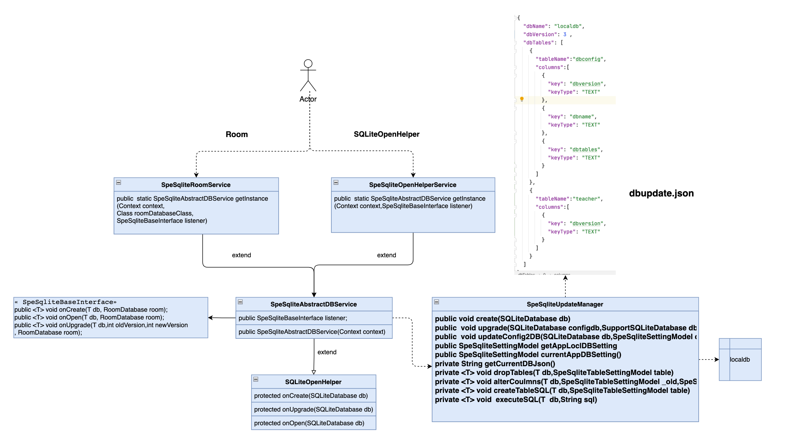
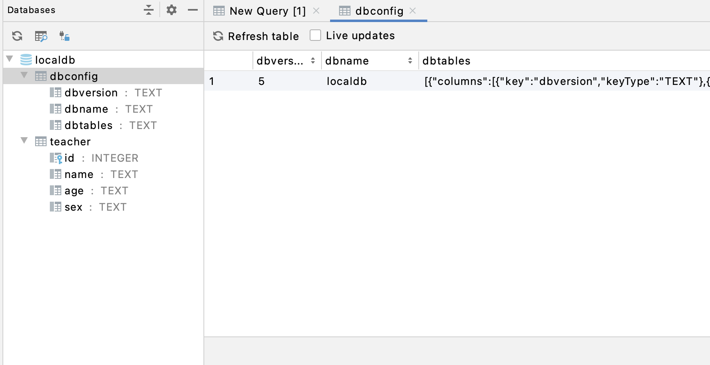

<!--
 * @Author: user.email
 * @Date: 2023-02-14 22:20:49
 * @LastEditors: user.email
 * @LastEditTime: 2023-02-17 09:17:45
 * @FilePath: /undefined/Users/Points/Documents/gitee-git/SpeSqliteManager4Android/README.md
 * @Description: 
 * 
 * Copyright (c) 2023 by ${git_email}, All Rights Reserved. 
-->
# SpeSqliteManager4Android

#### 改动日志
```
2023.2.14 完成SQLiteOpenHelper 
2023.2.23 完成room
2023.2.25 完成架构重构
2023.2.26 新增架构设计图说明
```

#### 介绍
一个轻量级无侵入式管理android数据库自动升级的管理类(支持SQLiteOpenHelper、room)

妈妈再也不用担心写一坨坨的migration或是手动sql去升级数据库

#### 核心设计思想
1.以静制动:配置项代替代码，保证代码稳定性

#### 架构设计


#### 关配置项json:
* 1.dbName:数据库文件名称,要保持稳定，不能修改。
* 2.dbVersion:数据库版本号,判断本地数据库文件是否升级就通过此key,升级时要保证新版本号大于当前的。
* 3.dbTables:想要创建的表名,每个表名下是具体的字段。

#### 集成步骤 
1.导入依赖库
```
    implementation 'com.google.code.gson:gson:2.8.9'
    implementation "androidx.room:room-runtime:2.0.0"
    annotationProcessor "androidx.room:room-compiler:2.0.0"
```
2.在assets目录下新建dbupdate.json
注意:dbconfig的配置不要动，自己的表在后面新增

3. SQLiteOpenHelper的调用方法
```
        //1.直接创建SQLiteOpenHelper
        SpeSqliteOpenHelperService.getInstance(this);
        //2.创建SQLiteOpenHelper且需要监听db
        SpeSqliteOpenHelperService.getInstance(this, new SpeSqliteBaseInterface() {
            @Override
            public <T> void onCreate(T db, RoomDatabase room) {

            }

            @Override
            public <T> void onOpen(T db, RoomDatabase room) {

            }

            @Override
            public <T> void onUpgrade(T db, int oldVersion, int newVersion, RoomDatabase room) {

            }
        });

```
3. Room的调用方法
```
        //3.直接创建room
        SpeSqliteRoomService.getInstance(this,AppDatabase.class);

        //4.创建room，且需要监听db
        SpeSqliteRoomService.getInstance(this,AppDatabase.class,new SpeSqliteBaseInterface() {
            @Override
            public <T> void onCreate(T db, RoomDatabase room) {
                //TODO  删除测试插入代码
                if(room != null){
                    ServerModel model = new ServerModel();
                    model.setId("1");
                    model.setHost("1");
                    model.setLang("1");
                    model.setName("1");
                    model.setVersion("1");
                    insert(room,model);
                }

            }
            @Override
            public <T> void onOpen(T db, RoomDatabase room) {

            }

            @Override
            public <T> void onUpgrade(T db, int oldVersion, int newVersion, RoomDatabase room) {

            }
        }); 
```

#### 核心代码
> SpeSqliteUpdateManager 负责针对本地db的创建、新建表、表字段升级、删除表,通过配置的方式去升级数据库，减少代码的改动，核心思想：以静制动

```
  /**
     * 数据库第一次创建时的调用函数
     * @param db db
     */
    public void create(SQLiteDatabase db){
        SpeSqliteSettingModel currentDBModel = SpeSqliteUpdateManager.getInstance().currentAppDBSetting();
        for(int i=0;i<currentDBModel.dbTables.size();i++){
            SpeSqliteTableSettingModel table = currentDBModel.dbTables.get(i);
            String sql = " create table if not exists "+table.tableName+" (";
            for(int j=0;j<table.columns.size();j++){
                SpeSqliteColumnSettingModel column = table.columns.get(j);
                sql+=column.key+" ";
                sql+=column.keyType;
                if(j==table.columns.size()-1){
                    sql+=" ";
                }else {
                    sql+=",";
                }
            }
            sql+=")";
            executeSQL(db,sql);
        }
        //SQLiteDatabase数据库才需要升级本地数据配置
        if(db instanceof SQLiteDatabase){
            SQLiteDatabase _db = (SQLiteDatabase)db;
            updateConfig2DB(_db,currentDBModel);
        }
    }

    /**
     * 升级数据库，此处涉及3种改动：1.新建表 2.老表新增字段 3.删除表
     * 注意该方法会被两个数据库依次触发，所以需要控制
     * 1.新建表的处理思路：比较简单直接create即可
     * 2.老表新增字段需要遍历db中的json表字段明细和当前app中的json明细
     * @param db db
     */
    public  void upgrade(SQLiteDatabase configdb,SupportSQLiteDatabase db){
        SpeSqliteSettingModel newConfig = this.currentAppDBSetting();
        SpeSqliteSettingModel localConfig = this.getAppLoclDBSetting(configdb);
        //该处判断可以不要，但是加了后(daupdate.json的dbversion字段)效率更高
        if(localConfig.dbVersion< newConfig.dbVersion){//通过dbversion直接判断是否要升级
            //防止room数据未创建表,就alter
            if(db != null){
                for(int i=0;i<localConfig.dbTables.size();i++) {
                    SpeSqliteTableSettingModel _local = localConfig.dbTables.get(i);
                    createTableSQL(db,_local);
                }
            }
            for(int j=0;j<newConfig.dbTables.size();j++){
                SpeSqliteTableSettingModel _new = newConfig.dbTables.get(j);
                for(int i=0;i<localConfig.dbTables.size();i++){
                    SpeSqliteTableSettingModel _local = localConfig.dbTables.get(i);
                    if(_local.tableName.equals(_new.tableName)){//找到，再判断字段是否有新增
                        _local.indexed = true;//被比较过,该表不用删除
                        if(_local.columns.size()<_new.columns.size()){
                            //执行alert去新增字段 //
                            alterCoulmns(db != null?db:configdb,_local,_new);
                        }
                        break;//只要匹配到就直接跳出该层循环
                    }
                }
                //本地数据没找到这个表需要新增
                createTableSQL(db != null?db:configdb,_new);
            }
            //针对被废弃的表需要在本地库中删除
            for(int i=0;i<localConfig.dbTables.size();i++){
                SpeSqliteTableSettingModel table = localConfig.dbTables.get(i);
                if(!table.indexed){
                    dropTables(db != null?db:configdb,localConfig.dbTables.get(i));
                }
            }
            //只有当是SQLiteDatabase升级时才能本地数据配置
            if(db == null){
                updateConfig2DB(configdb,newConfig);
            }
        }
    }

    /**
     * 移除老表
     * @param db db
     * @param table table
     * @param <T> 范型（需考虑SQLiteOpenHelper和room）
     */
    private <T> void dropTables(T db,SpeSqliteTableSettingModel table){
        String sql = " DROP TABLE IF EXISTS "+table.tableName;
        executeSQL(db,sql);
    }

    /**
     * 老表新增字段
     * @param db db
     * @param _old 老表字段配置
     * @param _new 表新字段配置
     * @param <T> 范型（需考虑SQLiteOpenHelper和room）
     */
    private <T> void alterCoulmns(T db,SpeSqliteTableSettingModel _old,SpeSqliteTableSettingModel _new){
        for(int i=0;i<_new.columns.size();i++){
            if(i>=_old.columns.size()){
                SpeSqliteColumnSettingModel column = _new.columns.get(i);
                String sql = " alter table "+_old.tableName+" add column ";
                sql+=column.key;
                sql+=" ";
                sql+= column.keyType;
                executeSQL(db,sql);
            }
        }
    }

    /**
     * 新增表
     * @param db db
     * @param table 表配置
     * @param <T> 范型（需考虑SQLiteOpenHelper和room）
     */
    private <T> void createTableSQL(T db,SpeSqliteTableSettingModel table){
        String sql = " create table if not exists "+table.tableName+" (";
        for(int j=0;j<table.columns.size();j++){
            SpeSqliteColumnSettingModel column = table.columns.get(j);
            sql+=column.key+" ";
            sql+=column.keyType;
            if(j==table.columns.size()-1){
                sql+=")";
            }else {
                sql+=",";
            }
        }
        executeSQL(db,sql);
    }
```


#### 运行效果

